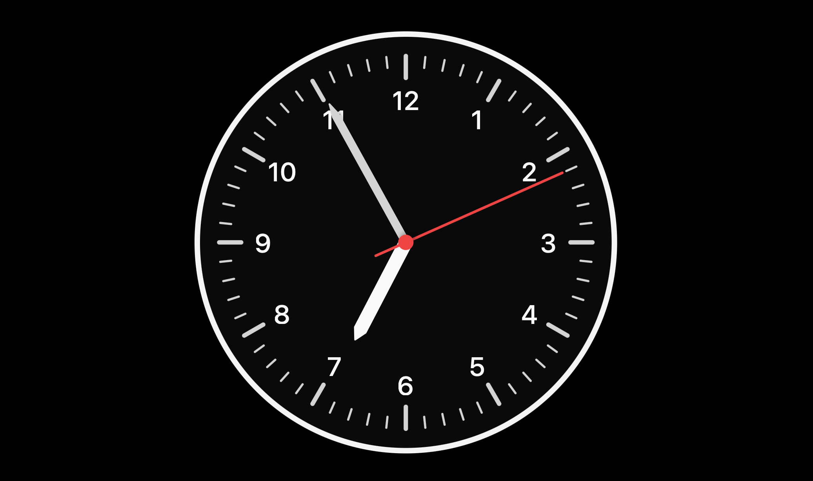
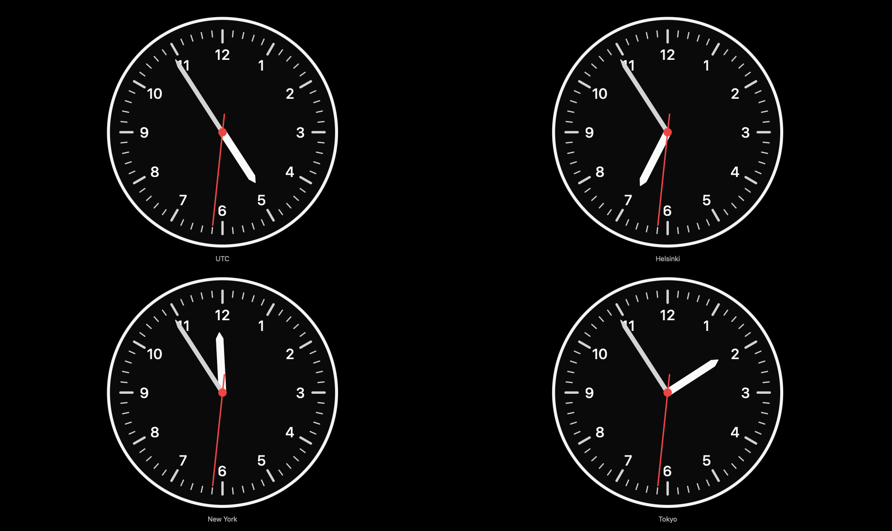

# clocksimulator

[](https://github.com/timoheimonen/clocksimulator/stargazers)
[](https://github.com/timoheimonen/clocksimulator/network/members) [](https://www.websitecarbon.com/website/clocksimulator-com/)

A clean, fullscreen analog clock simulator built with plain HTML, CSS, and JavaScript.
This is a minimalist, old-school web page with no trackers, no cookies, and no extra bloat. Just a pure analog clock, nothing more.

<p align="center">
  
  
</p>

## Timezone support

By default the clock shows your local time. To display a different timezone, add the `tz` query parameter with any valid [IANA timezone identifier](https://en.wikipedia.org/wiki/List_of_tz_database_time_zones):

```
https://www.clocksimulator.com/?tz=America/New_York
https://www.clocksimulator.com/?tz=Asia/Tokyo
https://www.clocksimulator.com/?tz=Europe/Helsinki
https://www.clocksimulator.com/?tz=UTC
```

If the value is invalid or omitted, the clock falls back to your local timezone.

## Multi-clock dashboard

Show multiple clocks at once by separating timezones with commas:

```
https://www.clocksimulator.com/?tz=UTC,Europe/Helsinki,America/New_York
https://www.clocksimulator.com/?tz=UTC,Europe/Helsinki,America/New_York,Asia/Tokyo&rows=2
```

The grid layout is calculated automatically. Use the optional `rows` parameter to control the number of rows.
You can also build it visually: click the **info button** on [www.clocksimulator.com](https://www.clocksimulator.com) and select **Build dashboard** to open the dashboard builder with live preview and a copy-ready link.

Feature of easy url with multiple timezones requested by "Hacker News" user "elteto".

## Embed

You can embed the clock on any website using an iframe. Click the **info button** on [www.clocksimulator.com](https://www.clocksimulator.com) and select **Embed this clock** to open the generator with a live preview and copy-ready code.

### Quick start

Round (default):

```html
<iframe src="https://www.clocksimulator.com/?embed=true"
  width="200" height="200" frameborder="0"
  style="border:none; border-radius:50%; overflow:hidden;">
</iframe>
```

Square:

```html
<iframe src="https://www.clocksimulator.com/?embed=true"
  width="200" height="200" frameborder="0"
  style="border:none; overflow:hidden;">
</iframe>
```

Custom border radius:

```html
<iframe src="https://www.clocksimulator.com/?embed=true"
  width="200" height="200" frameborder="0"
  style="border:none; border-radius:16px; overflow:hidden;">
</iframe>
```

The shape is controlled via the iframe's CSS `border-radius` — use `50%` for round, `0` for square, or any value like `8px`, `16px` for rounded corners.

### Parameters

All parameters are optional and can be combined:

| Parameter  | Values | Default | Description |
|------------|--------|---------|-------------|
| `embed`    | `true` | — | Activates embed mode (hides UI controls) |
| `tz`       | IANA timezone(s), comma-separated | Local time | Timezone(s), e.g. `Europe/Helsinki` or `UTC,Europe/Helsinki,America/New_York` |
| `rows`     | Number | Auto | Number of grid rows for multi-clock dashboard |
| `theme`    | `dark`, `light`, `transparent` | `dark` | Color theme |
| `seconds`  | `tick`, `smooth`, `hide` | `tick` | Second hand mode |
| `border`   | `show`, `hide` | `show` | Clock border visibility |
| `daynight` | `show`, `hide` | `hide` | Sun/moon indicator for day/night |
| `numbers`  | `show`, `hide` | `show` | Clock numbers visibility |
| `shadows`  | `true`, `false` | `true` | Hand and center dot shadows |
| `burnin`   | `true`, `false` | `true` | Screen burn-in protection (pixel shift) |

### Examples

```
https://www.clocksimulator.com/?embed=true&tz=Asia/Tokyo&theme=light
https://www.clocksimulator.com/?embed=true&seconds=smooth&border=hide
https://www.clocksimulator.com/?embed=true&tz=America/New_York&theme=dark&seconds=hide
```

## Privacy

- Repo policy: [`PRIVACY.md`](PRIVACY.md)
- Live site page: [`www.clocksimulator.com/privacy.html`](https://www.clocksimulator.com/privacy.html)

## License

MIT. See `LICENSE`.

## Author

Timo Heimonen <timo.heimonen@proton.me>

> "I built this clock for anyone who needs it, as a hobby project: I wrote the code, bought the domain for 10 years, and put it online. It’s a clock for everyone to use and enjoy, but it’s not something you can pay me for."
