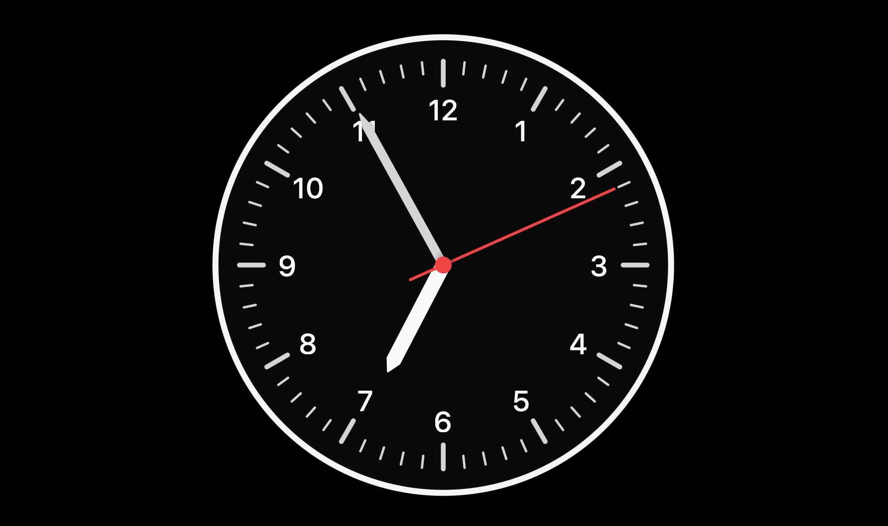
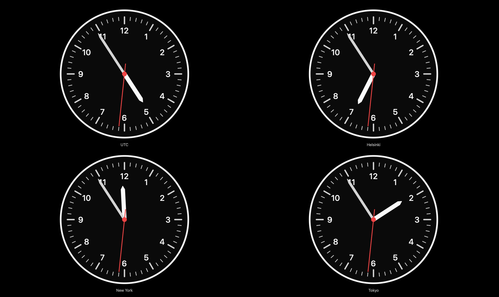
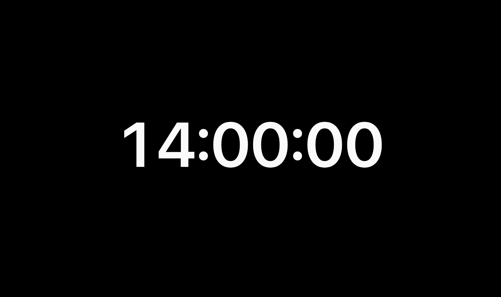
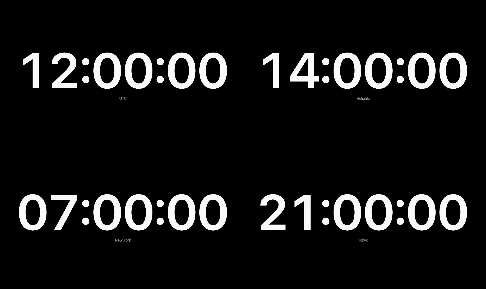

# clocksimulator

[](https://github.com/timoheimonen/clocksimulator/stargazers)
[](https://github.com/timoheimonen/clocksimulator/network/members) [](https://www.websitecarbon.com/website/clocksimulator-com/)

A clean, fullscreen clock simulator built with plain HTML, CSS, and JavaScript.
The site is available as both an analog clock at [`clocksimulator.com`](https://clocksimulator.com) and a digital clock at [`clocksimulator.com/digital/`](https://clocksimulator.com/digital/).
This is a minimalist, old-school web page with no trackers, no cookies, and no extra bloat. Just a pure clock, nothing more.

<p align="center">
  
  
  
  
</p>

## Goals
- Privacy first
- Keep it light and fast
- No ads or tracking cookies, ever
- No user accounts
- No backend
- No 3rd party libraries, only HTML/JS/CSS that can run even offline
- Free for everyone
- Make it as maintenance free as possible
- Just a clock, nothing more or less

## Architecture & Performance

clocksimulator is intentionally built as two **self-contained, Edge-Native pages** (`public/index.html` and `public/digital/index.html`). This architecture ensures infinite scalability, maximum reliability, and lightning-fast performance.

* **Self-Contained Simplicity:** Keeping each application in one file minimizes HTTP requests and simplifies deployment. While long files are a maintenance tradeoff, the project stays focused to avoid unnecessary complexity.
* **Originless Edge Distribution:** Hosted on **Cloudflare Pages**, the site has no single origin server that can be overwhelmed. Assets are served directly from the global edge network, ensuring good cache hit rate and minimal latency worldwide.
* **Client-Side Execution:** 100% of the logic and rendering happen in the user's browser. There is no backend to crash; the performance is limited only by the client's device.

## Timezone support

By default the clock shows your local time. To display a different timezone, add the `tz` query parameter with any valid [IANA timezone identifier](https://en.wikipedia.org/wiki/List_of_tz_database_time_zones):

Analog:

```
https://clocksimulator.com/?tz=America/New_York
https://clocksimulator.com/?tz=Asia/Tokyo
https://clocksimulator.com/?tz=Europe/Helsinki
https://clocksimulator.com/?tz=UTC
```

Digital:

```
https://clocksimulator.com/digital/?tz=America/New_York
https://clocksimulator.com/digital/?tz=Asia/Tokyo
https://clocksimulator.com/digital/?tz=Europe/Helsinki
https://clocksimulator.com/digital/?tz=UTC
```

If the value is invalid or omitted, the clock falls back to your local timezone.

## Multi-clock dashboard

Show multiple clocks at once by separating timezones with commas:

Analog:

```
https://clocksimulator.com/?tz=UTC,Europe/Helsinki,America/New_York
https://clocksimulator.com/?tz=UTC,Europe/Helsinki,America/New_York,Asia/Tokyo&rows=2
```

Digital:

```
https://clocksimulator.com/digital/?tz=UTC,Europe/Helsinki,America/New_York
https://clocksimulator.com/digital/?tz=UTC,Europe/Helsinki,America/New_York,Asia/Tokyo&rows=2
```

The grid layout is calculated automatically. Use the optional `rows` parameter to control the number of rows.
You can also build it visually: click the **info button** on [clocksimulator.com](https://clocksimulator.com) and select **Build dashboard** to open the dashboard builder with live preview and a copy-ready link.

Feature of easy url with multiple timezones requested by "Hacker News" user "elteto".

## Embed

You can embed either clock on any website using an iframe. Click the **info button** on [clocksimulator.com](https://clocksimulator.com) and select **Embed this analog clock** or open [`/digital/`](https://clocksimulator.com/digital/) and select **Embed this digital clock** to use the generator with a live preview and copy-ready code.

### Quick start

Round (default):

```html
<iframe src="https://clocksimulator.com/?embed=true"
  width="200" height="200" frameborder="0"
  style="border:none; border-radius:50%; overflow:hidden;">
</iframe>
```

Square:

```html
<iframe src="https://clocksimulator.com/?embed=true"
  width="200" height="200" frameborder="0"
  style="border:none; overflow:hidden;">
</iframe>
```

Custom border radius:

```html
<iframe src="https://clocksimulator.com/?embed=true"
  width="200" height="200" frameborder="0"
  style="border:none; border-radius:16px; overflow:hidden;">
</iframe>
```

The shape is controlled via the iframe's CSS `border-radius` — use `50%` for round, `0` for square, or any value like `8px`, `16px` for rounded corners.

### Parameters

All parameters are optional and can be combined:

| Parameter  | Values | Default | Description |
|------------|--------|---------|-------------|
| `embed`    | `true` | — | Activates embed mode (hides UI controls) |
| `tz`       | IANA timezone(s), comma-separated | Local time | Timezone(s), e.g. `Europe/Helsinki` or `UTC,Europe/Helsinki,America/New_York` |
| `rows`     | Number | Auto | Number of grid rows for multi-clock dashboard |
| `theme`    | `dark`, `light`, `transparent` | OS preference (light fallback) | Color theme |
| `seconds`  | `tick`, `smooth`, `hide` | `tick` | Second hand mode |
| `border`   | `show`, `hide` | `show` | Clock border visibility |
| `daynight` | `show`, `hide` | `hide` | Sun/moon indicator for day/night |
| `numbers`  | `show`, `hide` | `show` | Clock numbers visibility |
| `shadows`  | `true`, `false` | `true` (single), `false` (dashboard) | Hand and center dot shadows |
| `burnin`   | `true`, `false` | `true` | Screen burn-in protection (pixel shift) |

## Accessibility

When the operating system's **prefers-reduced-motion** setting is active, the second hand and clock hand shadows are automatically disabled to reduce on-screen animation.

## Chrome extension
Chrome extension is also available at [Google Chrome web store](https://chromewebstore.google.com/detail/clocksimulatorcom/ljbpiigocbebamekohcpemgepjickldb).
Extension replaces new tab page with analog clock.
[GitHub repo](https://github.com/timoheimonen/chrome-extension-clocksimulator) also available.
Extension follows main clocksimulator.com version, but not always updated 1:1 and might vary in features.

## Testing

The release suite uses pytest and Playwright to cover both clocks, browser lifecycles, offline behavior, Cloudflare routing, accessibility, and visual regressions. No build step is required. See [`TESTING.md`](TESTING.md) for the test strategy and behavior matrix.

```bash
# Create the project test environment and install browsers
conda env create --file environment.yml
conda run -n clocksimulator python -m playwright install chromium firefox webkit
npm install --global wrangler@4.28.0

# Run all tests
conda run -n clocksimulator python -m pytest

# Run the complete local release matrix
./run_release_tests.sh

# Run only visual snapshot tests
conda run -n clocksimulator python -m pytest -m visual

# Explicitly regenerate reviewed screenshot baselines
conda run -n clocksimulator python -m pytest -m visual --update-snapshots
```

## Privacy & Terms of service

- [`clocksimulator.com/privacy`](https://clocksimulator.com/privacy)
- [`clocksimulator.com/TOS`](https://clocksimulator.com/TOS)

## License

MIT. See `LICENSE`.

## Author

Timo Heimonen <timo.heimonen@proton.me>
